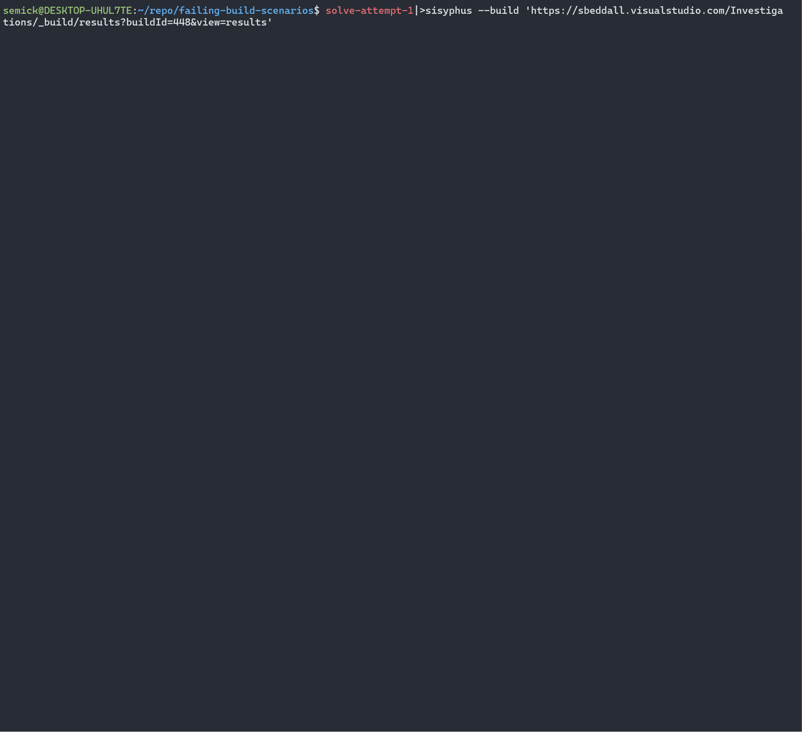

# sisyphus

Have you ever fought a failing build and wanted to die? Enter `sisyphus`. It is a local ralph loop for fixing _builds_, not self improving _agents_.

Give it:
- A build definition and an optional initial prompt
  - Watch it drive that definition till it has something building successfully
- A failed build
  - Watch it interpret those errors and come up with a fix! 

These run _locally_, using your **logged in cli context** so that you can easily drop in an out of the loop.


For things that are seemingly just fighting with the OS or system, let this simple agent loop push the rock for you.



The agent is written in go.

Install onto your path:

```bash
go install ./cmd/sisyphus
```

## Invocation Patterns

`sisyphus` uses the current shell's context, so the intended usage pattern is:

- open new terminal window
- cd to repo folder
- `git checkout` a branch for work, set up default origin
- invoke `sisyphus`

`--build` supports two URL forms:

- Build definition URL (`?definitionId=...`): queues a new build for your current branch. You will be prompted for an optional initial prompt; if the prompt results in changes, they are committed/pushed before the build definition is queued. This offers an opportunity for a change to a stable build OR a requeue to get latest failure mode of a build definition.
- Build results URL (`?buildId=...`): treats that starting build as a failure context, attempts a fix, commits/pushes, then enters the normal queue/wait loop.

```bash
# install as instructed above
sisyphus -h
Usage of sisyphus:
  -build string
        ADO build definition URL or build results URL.
  -cli string
        CLI executor to invoke for autopilot. (default "codex")
  -log-max-bytes int
        Max bytes of log content to attach to instructions. (default 300000)
  -pat string
        ADO PAT token. Optionally sourced from ADO_PAT environment variable. Requires Azure DevOps Build scope with Read and Execute permissions.
  -sleep-seconds int
        Seconds to sleep between loop iterations and for polling a provided starting buildId. Newly queued builds are polled every 10 seconds. (default 30)

```

```bash
sisyphus \
  --build "https://sbeddall.visualstudio.com/Investigations/_build/results?buildId=448&view=results"
  --pat=$ADO_PAT

export ADO_PAT=<set from somewhere in your session previously>

# build definition url, will be prompted before queueing a new run
sisyphus \
  --build "https://sbeddall.visualstudio.com/Investigations/_build?definitionId=8"
```
